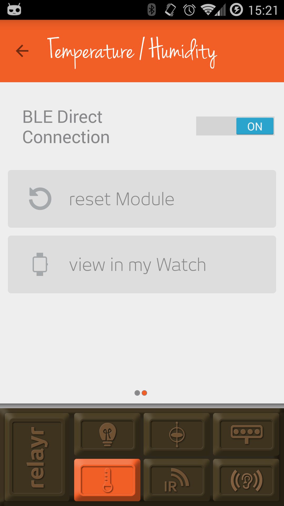

# The relayr BLE Thermometer App

The relayr BLE thermometer app uses the Temperature and Humidity sensor and the BLE direct connection functionality in order to 
display the temperature reading in the environmnet where the sensor is placed. In this version of the app the relayr cloud platform
is not used.

**Please note** that in order to receive sensor data over BLE rather than via the relayr cloud, you would need to switch the sensor to BLE mode: 

1. Access your Manage App
2. Tap the sensor icon
3. Swipe to the lef
4. turn on the BLE Direct Connection option

Check out the version of the thermometer utilizing the relayr cloud platform [here](https://github.com/relayr/android-demo-apps/tree/master/thermometer)
